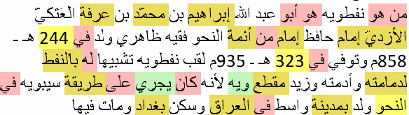
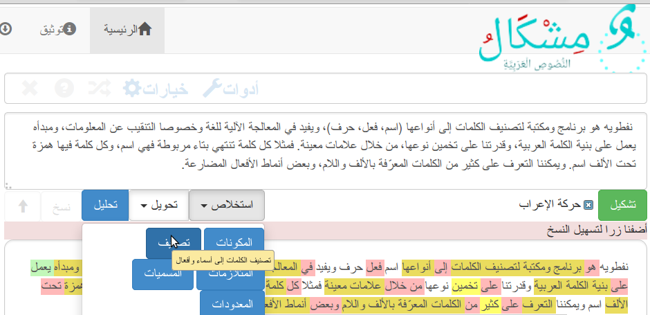

# نفطويه: تصنيف الكلمات العربية Naftawayh: Arabic Word Tagger
Naftawayh is a python library for Arabic word tagging (word classification) into types (nouns, verbs, stopwords), which is useful in language processing, especially for text mining. Naftawayh works according to the Arabic word structure, and the ability to guess the word class, through certain signs. For example, a word which ends Teh Marbuta, is a noun. Hamza Below Alef, class the word as a noun. We can identify many kins of words, by patterns especially for verbs in present tense and defined words. 

نفطويه هو برنامج ومكتبة لتصنيف الكلمات إلى أنواعها (اسم، فعل، حرف)، ويفيد في المعالجة الآلية للغة وخصوصا التنقيب عن المعلومات، ومبدأه يعمل على بنية الكلمة العربية، وقدرتنا على تخمين نوعها، من خلال علامات معينة. فمثلا كل كلمة تنتهي بتاء مربوطة فهي اسم، وكل كلمة فيها همزة تحت الألف اسم. ويمكننا التعرف على كثير من الكلمات المعرّفة بالألف واللام، وبعض أنماط الأفعال المضارعة. 


  Developpers:  Taha Zerrouki: http://tahadz.com
    taha dot zerrouki at gmail dot com

Features |   value
---------|---------------------------------------------------------------------------------
Authors  | Taha Zerrouki: http://tahadz.com,  taha dot zerrouki at gmail dot com
Release  | 0.3
License  |[GPL](https://github.com/linuxscout/naftawayh/master/LICENSE)
Tracker  |[linuxscout/naftawayh/Issues](https://github.com/linuxscout/naftawayh/issues)
Website  |[https://pypi.python.org/pypi/naftawayh](https://pypi.python.org/pypi/naftawayh)
Doc  |[package Documentaion](http://pythonhosted.org/naftawayh/)
Source  |[Github](http://github.com/linuxscout/naftawayh)
Download  |[pypi.python.org](https://pypi.python.org/pypi/naftawayh)
Feedbacks  |[Comments](https://github.com/linuxscout/naftawayh/issues)
Accounts  |[@Twitter](https://twitter.com/linuxscout)  [@Sourceforge](http://sourceforge.net/projects/naftawayh/)


## Citation
If you would cite it in academic work, can you use this citation
```
T. Zerrouki‏, Naftawayh,  Arabic Word Tagger,
  https://pypi.python.org/pypi/naftawayh/, 2010
```
or in bibtex format

```bibtex
@misc{zerrouki2012naftawayh,
  title={Naftawayh : Arabic Word Tagger},
  author={Zerrouki, Taha},
  url={https://pypi.python.org/pypi/naftawayh,
  year={2010}
}
```


## مزايا
* 

## Features
* 

Applications
====
* Text mining.
* Text summarizing.
* Sentences identification.
* Grammar analysis.
* Morphological analysis acceleration.
* Extraction of ngrams..

ـطبيقات 
====
* التنقيب عن المعلومات.
* تلخيص النص.
* التعرف على الجمل.
* التحليل النحوي.
* تسريع التحليل الصرفي.
* استخراج المصطلحات والمسكوكات والمتلازمات.

من هو نفطويه Who is Naftawayh
====



Demo جرّب
====
يمكن التجربة على [موقع مشكال](http://tahadz.com/mishkal)
، اختر أدوات، ثم استخلاص ثم تصنيف
You can test it on [Mishkal Site](http://tahadz.com/mishkal), choose: Tool > extraction > Classify.



Installation
=====
```
pip install naftawayh
```    
    
Usage
=====
```python
import naftawayh.wordtag as wordtag
```
Example
=====
Test word list
======
```python
>>> import naftawayh.wordtag 
>>> word_list=(u'بالبلاد', u'بينما', u'أو', u'انسحاب', u'انعدام', 
u'انفجار', u'البرنامج', u'بانفعالاتها', u'العربي', u'الصرفي', 
u'التطرف', u'اقتصادي', )
>>> tagger = naftawayh.wordtag.WordTagger();
>>> # test all words
>>> list_tags = tagger.word_tagging(word_list)
>>> for word, tag in zip(word_list, list_tags):
>>>     print word, tag
بالبلاد n
بينما vn3
أو t
انسحاب n
انعدام n
انفجار n
البرنامج n
بانفعالاتها n
العربي n
الصرفي n
التطرف n
اقتصادي n
```
Test word by word
======
```python
>>> import naftawayh.wordtag 
>>> word_list=(u'بالبلاد', u'بينما', u'أو', u'انسحاب', u'انعدام', 
u'انفجار', u'البرنامج', u'بانفعالاتها', u'العربي', u'الصرفي', 
u'التطرف', u'اقتصادي', )
>>> tagger = naftawayh.wordtag.WordTagger();        
>>> #test word by word
>>> for word in word_list:
>>>     if tagger.is_noun(word):
>>>         print(u'%s is noun'%word)
>>>     if tagger.is_verb(word):
>>>         print(u'%s is verb'%word)
>>>     if tagger.is_stopword(word):
>>>         print(u'%s is stopword'%word)
بالبلاد is noun
بينما is noun
بينما is verb
أو is noun
أو is verb
أو is stopword
انسحاب is noun
انعدام is noun
انفجار is noun
البرنامج is noun
بانفعالاتها is noun
العربي is noun
الصرفي is noun
التطرف is noun
اقتصادي is noun

```
Test word in context
======
```python
>>> import naftawayh.wordtag 
>>> word_list=(u'بالبلاد', u'بينما', u'أو', u'انسحاب', u'انعدام', 
u'انفجار', u'البرنامج', u'بانفعالاتها', u'العربي', u'الصرفي', 
u'التطرف', u'اقتصادي', )
>>> tagger = naftawayh.wordtag.WordTagger();
>>> previous_word=""
>>> print (" **** test words in context***")
>>> # test words in context
>>> for word in word_list:
>>>     tag=tagger.context_analyse(previous_word,word);
>>>     print(u"%s from context is %s "%(word,tag))
>>>     previous_word=word;
**** test words in context***
بالبلاد from context is vn 
بينما from context is vn 
أو from context is vn 
انسحاب from context is vn 
انعدام from context is vn 
انفجار from context is vn 
البرنامج from context is vn 
بانفعالاتها from context is vn 
العربي from context is vn 
الصرفي from context is vn 
التطرف from context is vn 
اقتصادي from context is vn 

```
Package Documentation
=====
[https://pythonhosted.org/naftawayh/](https://pythonhosted.org/naftawayh/)

Files
=====
* file/directory    category    description 
 * wordtag.py: class to use word tag guessing


